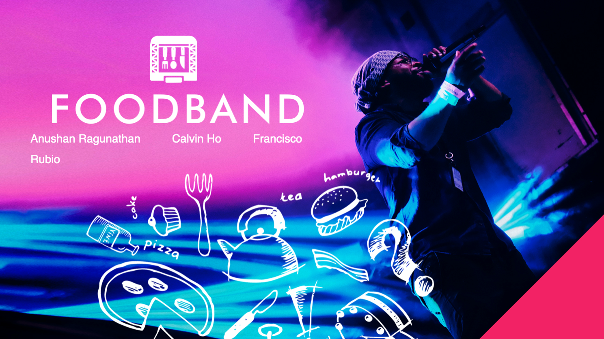

 
<h1 align = "center">Foodbands</h1>

<!-- TABLE OF CONTENTS -->

  
Table of Contents

  <ol>
    <li>
      <a href="#about-the-project">About The Project</a>
      <ul>
        <li><a href="#built-with">Built With</a></li>
      </ul>
    </li>
    <li><a href="#usage">Usage</a></li>
    <li><a href="#roadmap">Roadmap</a></li>
    <li><a href="#contributing">Contributing</a></li>
    <li><a href="#contact">Contact</a></li>
    
  </ol>

 

<!-- ABOUT THE PROJECT -->
## About The Project

 

This application was designed for concert lovers that scramble and stumble to find a decent spot to eat late at night. After a night out to our favourite conecerts/events, our group finds that we always come across the same question.....

"Where do we eat?" 

Foodbands is an attempt to ease the decision making process of finding a quick, convinent and tast place to eat after a night out. 

* Nobody likes to go to bed after a concernt on an empty stomach...
* Plan your night out and be ready to know where to go after your concert/event has ended
* Check out quality places to grab a bite after your event!

(<a href="#top">back to top</a>)

### Built With

Our project was built with the following technologies:

* [Firebase](https://firebase.google.com/)
* [Bootstrap](https://getbootstrap.com)
* [JQuery](https://jquery.com)

<b>Firebase</b> was utilized for the “favorites” feature which allows users to store their favorite events and restaurants 
<b>Bootstrap</b> was utilized for the front-end design/elements as well as animations 
<b>jQuery</b> was utilized for DOM manupilation as well as AJAX calls

(<a href="#top">back to top</a>)

## Challenges

Along our build, we were met with many roadblocks. Here were some of the most pressing issues

* Integrate the images pulled from our API’s to match the card design layout that we created, so the alignment and responsiveness are working properly. 
* Making sure that our plugins and code used do not clash with each other. 
* Decide what features do we want to leave out and which ones we really need to get working.
* Integrating values from API calls into functions in our code. 

(<a href="#top">back to top</a>)

<!-- ROADMAP -->
## Roadmap

- [ ] Deeper Search Function
- [ ] Incorporate Nutritional Data
- [ ] Personalized suggestions

(<a href="#top">back to top</a>)

<!-- CONTRIBUTING -->
## Contributing

If you have a suggestion that would make this better, please fork the repo and create a pull request. You can also simply open an issue with the tag "enhancement".
Don't forget to give the project a star! Thanks again!

1. Fork the Project
2. Create your Feature Branch (`git checkout -b feature/AmazingFeature`)
3. Commit your Changes (`git commit -m 'Add some AmazingFeature'`)
4. Push to the Branch (`git push origin feature/AmazingFeature`)
5. Open a Pull Request

(<a href="#top">back to top</a>)

<!-- CONTACT -->
## Contact

Anushan R-  - contact@anushanr.com

Live Site: [https://anushanr.github.io/foodbands/](https://anushanr.github.io/foodbands/)

(<a href="#top">back to top</a>)

